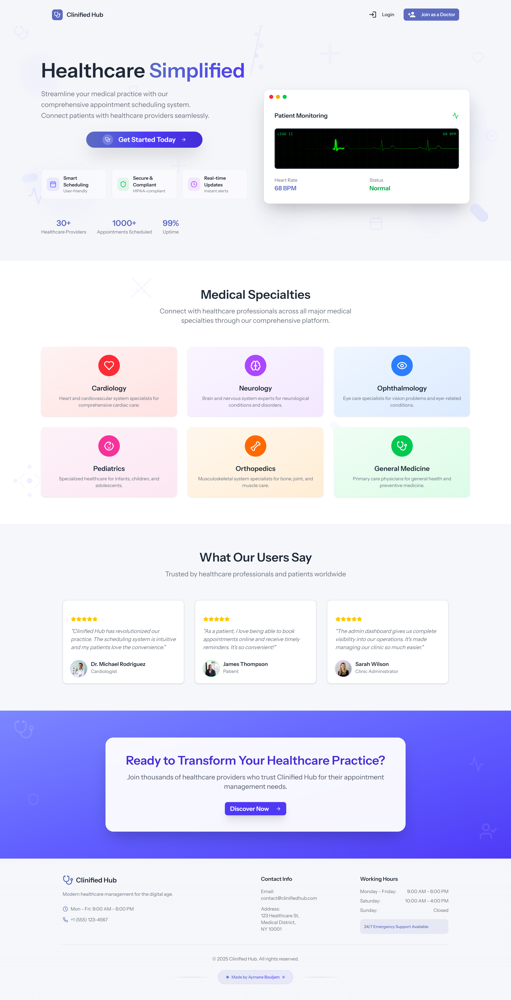
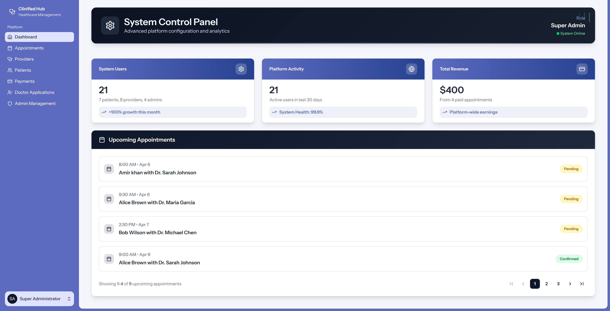
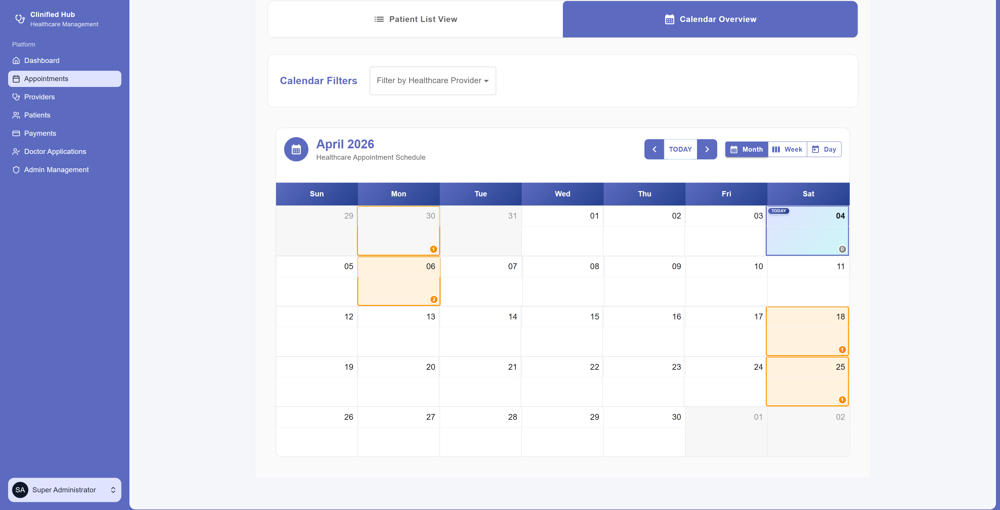
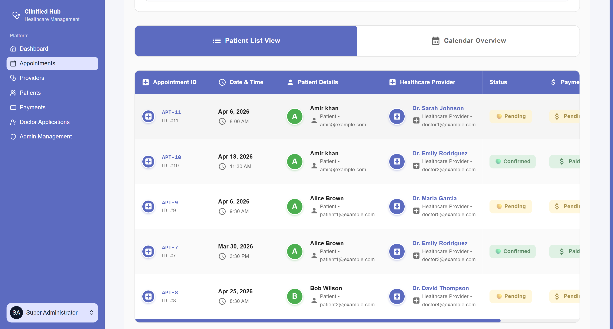
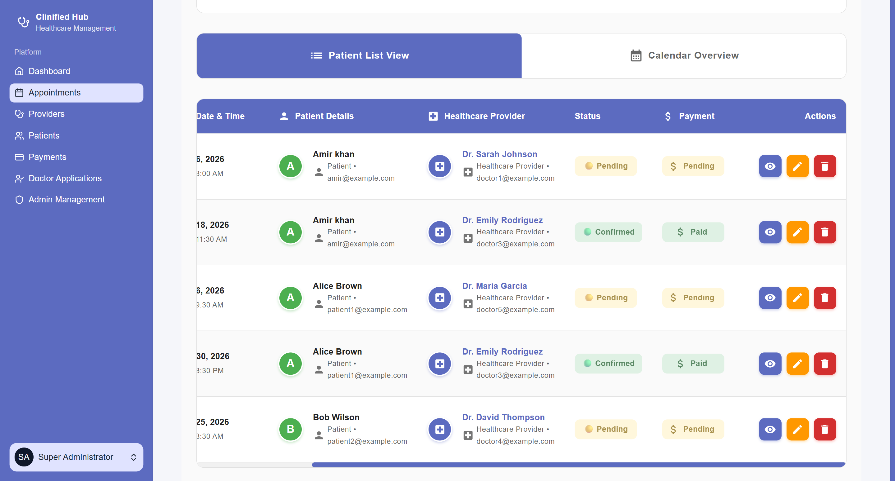

# Clinified Hub

Clinified Hub is a Healthcare platform built for patients, providers, admins, and super admins. It streamlines appointment booking, provider onboarding, payment management, and day-to-day operational visibility through a modern Laravel and React stack.

## Highlights

- Role-based dashboards for clients, providers, admins, and super admins
- Appointment booking, scheduling controls, and calendar management
- Doctor application review flow with protected document and photo access
- Patient, provider, and admin management
- Payment review and approval workflows
- Profile management, including avatar uploads

## Screenshots

This application includes many more screens and workflows than can be shown here. The screenshots below are a small sample to give a quick visual overview.

### Home



### Dashboard



### Calendar



### Patients



### Patient Details



## Tech Stack

- Backend: Laravel 12, PHP 8.4, Inertia.js
- Frontend: React 19, TypeScript, Vite
- Database: MySQL
- UI: Tailwind CSS v4, Radix UI, Material UI, Lucide Icons
- Tooling: PNPM, ESLint, Prettier, Laravel Pint, Pest

## Getting Started

### Requirements

- PHP 8.4+
- Composer
- Node.js 22+
- PNPM
- MySQL

### Installation

```bash
composer install
pnpm install
cp .env.example .env
php artisan key:generate
php artisan migrate
php artisan storage:link
```

Update your `.env` with your database and mail configuration before running the app.

This project was tested with a MySQL database.

### Run Locally

```bash
composer dev
```

This starts the Laravel server, queue listener, logs, and Vite development server together.

## Quality Checks

Run the full quality pipeline with:

```bash
composer qa
```

This runs Pint, Prettier, ESLint, TypeScript checks, the Laravel test suite, and the production build.

## Testing

```bash
php artisan test
```
